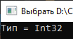

# Lesson10_addition_task
Условия задачки:
>Используя Visual Studio, создайте проект по шаблону Console Application.  
Создайте класс MyClass<T>, содержащий статический фабричный метод -  T FacrotyMethod(), который будет порождать экземпляры типа, указанного в качестве параметра типа (указателя места заполнения типом – Т). 

Подытог: вот такенный майндфак на выходе
>
